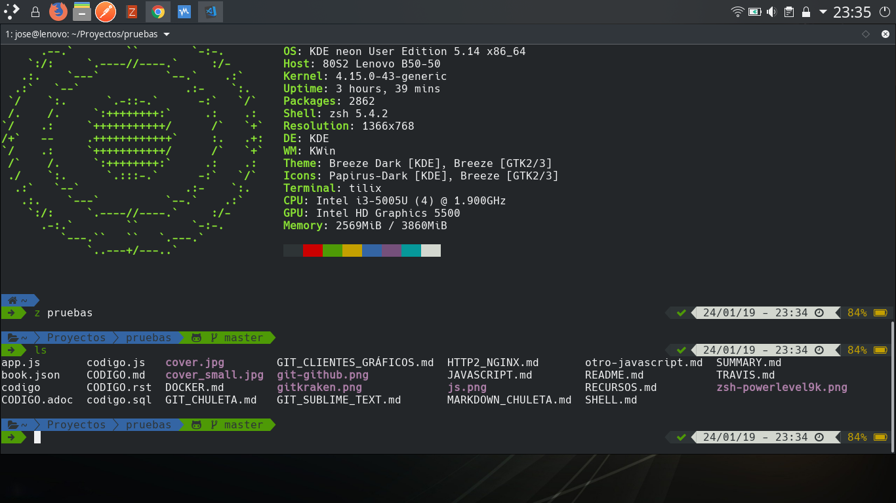

# SHELL (zsh)

zsh es un shell compatible con bash, pero que añade varias funcionalidades. Una de las más interesantes es su **integración con git**. 

## Referencias

- https://youtu.be/wM1uNqj71Ko

- https://ohmyz.sh/
- https://github.com/robbyrussell/oh-my-zsh
- https://github.com/bhilburn/powerlevel9k
- https://github.com/bhilburn/powerlevel9k/wiki/Show-Off-Your-Config
- https://github.com/ryanoasis/nerd-fonts
- https://char-map.herokuapp.com/
- https://github.com/rupa/z


## Instalación

**Instalamos shell y plugin**

```shell
sudo  apt  install  zsh  zsh-syntax-highlighting  neofetch
```

> `neofetch` es un comado que nos sirve para mostrar información del sistema al iniciar el terminal.


**Descargamos y ejecutamos script de configuración automática (Oh My ZSH)** 

```shell
curl -L https://raw.github.com/robbyrussell/oh-my-zsh/master/tools/install.sh | sh
```


**Establecemos zsh como shell por defecto**

```shell
chsh  -s  /bin/zsh
```


**Instalamos tema Powerlevel9k para Oh My ZSH**

```shell
# Descargamos tema
git  clone  https://github.com/bhilburn/powerlevel9k.git   ~/.oh-my-zsh/custom/themes/powerlevel9k
```


**Instalación de Nerd Fonts**

Para la configuración correcta de los glifos, no nos vale cualquier tipo de letra. 

Por ello vamos a https://github.com/ryanoasis/nerd-fonts, descargamos la fuente deseada y la instalamos en el sistema. 

Yo he descargado `Hack Nerd Font`.

```shell
wget https://github.com/ryanoasis/nerd-fonts/blob/master/patched-fonts/Hack/Regular/complete/Hack%20Regular%20Nerd%20Font%20Complete.ttf
```

La instalación puede hacerse desde el GUI, con la herramienta que proporciona nuestro escritorio para el manejo de tipos de letra. 

Es probable que necesitemos reiniciar el terminal/sesión gráfica para detectar la nueva fuente. 


**Establecemos la fuente del terminal**

Debemos utilizar la fuente que descargamos e instalamos previamente.

Para ello es necesario modificar las preferencias del terminal que estemos usando.


**(Opcional) Para usar comando `z` para recorrer directorios**

Permite visitar directorios frecent (frequent/recent)

```shell
sudo wget https://raw.githubusercontent.com/rupa/z/master/z.sh  -P  /bin
```

**(Opcional) Para usar comando `trash` para eliminar archivos a papelera**

Permite enviar archivos a la papelera. Es un borrado seguro a diferencia del comando `rm`.

```shell 
sudo  npm  install --global trash-cli
trash  <nombre_archivo_o_carpeta>
```


**Editamos archivo `~/.zshrc`**

Mi archivo de configuración es:

```shell
export ZSH="/home/jose/.oh-my-zsh"
ZSH_THEME="powerlevel9k/powerlevel9k"

POWERLEVEL9K_MODE="nerdfont-complete"

POWERLEVEL9K_LEFT_PROMPT_ELEMENTS=(root_indicator dir dir_writable vcs)
POWERLEVEL9K_RIGHT_PROMPT_ELEMENTS=(status background_jobs time battery)

POWERLEVEL9K_DIR_PATH_SEPARATOR=$' \uE0B1 '
POWERLEVEL9K_TIME_FORMAT="%D{%d/%m/%y - %H:%M}"

# Prompt settings
POWERLEVEL9K_PROMPT_ADD_NEWLINE=true
POWERLEVEL9K_PROMPT_ON_NEWLINE=true
POWERLEVEL9K_RPROMPT_ON_NEWLINE=true
POWERLEVEL9K_MULTILINE_FIRST_PROMPT_PREFIX="%K{white}%k"
POWERLEVEL9K_MULTILINE_LAST_PROMPT_PREFIX="%K{green}%F{black} \uf554 %f%F{green}%k\ue0b0%f "
plugins=( git )

source $ZSH/oh-my-zsh.sh
source /usr/share/zsh-syntax-highlighting/zsh-syntax-highlighting.zsh
source /bin/z.sh

neofetch

alias ll="ls -l"
alias la="ls -a"
alias nz="nano ~/.zshrc"
alias sz=". ~/.zshrc"
```

**Reiniciamos la configuración**

```sh
.   ~/.zshrc
```

**Resultado final**

- **Linux 4.15**
- **KDE Neon 18.04 (Plasma 5.14.5)**
- **Tilix (terminal)**




## Fuentes en TTY

Desgraciadamente los terminales tradicionales trabajan con fuentes en formato de bits, no vectoriales como las usadas previamente. 

Por lo tanto no es posible aplicar a las TTYs los temas que usan fuentes TTF. 
